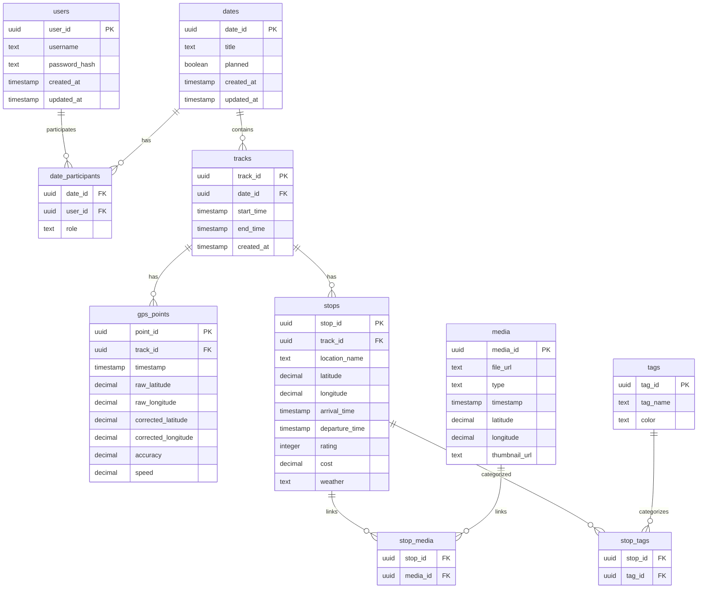

# お出掛け記録アプリ要件定義書

## 📋 プロジェクト概要

**アプリ名：** Pathly（お出掛け記録アプリ）  
**目的：** お出掛けの記録・計画・振り返りを行う  
**主要ユーザー：** 出掛けるのが好きな人、カップルなど（Android + iPhone環境）  
**開発方針：** 段階的開発（リアルタイム記録 → 事後振り返り → 事前計画）

## 🎯 基本仕様

### データ共有方法

- 基本：複数人でデータ共有・編集
- 将来：個別データ保持+必要時共有も検討

### 技術スタック

- **Android：** Kotlin + コルーチン + Jetpack Compose
- **BaaS：** Supabase（PostgreSQL + Edge Functions）
- **Web：** Next.js + Vercel
- **地図：** Google Maps SDK
- **状態管理：** ViewModel + StateFlow（コルーチン対応）
- **アーキテクチャ：** サーバーレス構成（常駐サーバーなし）

### 立ち寄り判定ロジック

- **メイン：** 50m圏内に3分以上滞在
- **補助：** 手動記録ボタン
- **将来：** 機械学習による高精度化

## 📊 データ構造（PostgreSQL）



## 🎨 UI設計方針

### ナビゲーション

- **タブ型：** [記録] [履歴] [地図] [計画] [設定]
- **記録開始：** ホーム画面の大きなボタン + 通知バーのクイックアクセス
- **デバッグ画面：** 開発時のログ・位置情報確認用画面（本番では非表示）

### デート中操作画面

```text
┌─────────────────┐
│  🎯 記録中 12:34  │ ← ステータス表示
│                 │
│   [📸 写真]      │ ← ワンタップ操作
│   [📍 場所]      │
│   [⏸ 一時停止]    │
│                 │
│ 今日の軌跡: 2.1km │ ← 簡単な情報
└─────────────────┘
```

## 🚀 機能一覧

### 📱 リアルタイム記録機能群

- [ ] GPS経路の自動記録・保存
- [ ] 外出の自動検知→記録開始
- [ ] 立ち寄り場所の自動検出（50m圏内+3分滞在）
- [ ] 手動での場所記録（ワンタップで位置+時刻）
- [ ] アプリ内カメラで写真撮影・保存
- [ ] 標準カメラ写真の自動検知・取り込み
- [ ] 音声メモ録音
- [ ] 動画撮影
- [ ] GPS座標の原データ保存
- [ ] リアルタイム経路表示
- [ ] 記録中ステータス表示
- [ ] バックグラウンド動作

### 🔧 GPS・位置補正機能群

- [ ] GPS座標の自動ノイズ除去
- [ ] 手動でマップ上タップ補正
- [ ] 住所検索での位置指定
- [ ] 既知スポットへのスナップ
- [ ] 原データと補正後データの両方保存
- [ ] 室内・地下でのGPS精度低下対応

### 📝 事後振り返り・編集機能群

- [ ] 記録の詳細追加・編集
- [ ] 場所名の手動入力・変更
- [ ] ★評価の追加
- [ ] コメント・感想の追加
- [ ] 費用の記録
- [ ] 天気情報の記録
- [ ] 滞在時間の編集
- [ ] タグ付け機能
- [ ] 写真に説明文追加
- [ ] 不要な記録の削除
- [ ] 日付・時刻の修正

### 📅 事前計画機能群

- [ ] 行きたい場所のリストアップ
- [ ] 場所の詳細情報登録（住所、営業時間等）
- [ ] デート計画の作成
- [ ] ルート計画・シミュレーション
- [ ] 予算計画
- [ ] 計画と実際の比較
- [ ] 行きたい場所の優先度設定
- [ ] カレンダー連携

### 🗺️ 地図・表示機能群

- [ ] Google Maps連携
- [ ] 軌跡の地図表示
- [ ] 立ち寄り場所のマーカー表示
- [ ] 日別・期間別の軌跡表示
- [ ] ヒートマップ表示
- [ ] 写真の地図上表示
- [ ] ズーム・パン操作
- [ ] 地図スタイルの切り替え
- [ ] オフライン地図対応

### 📊 データ管理・一覧機能群

- [ ] デート履歴の一覧表示
- [ ] カレンダー形式での表示
- [ ] 写真ギャラリー
- [ ] 統計情報（総距離、回数、費用等）
- [ ] 検索・フィルタリング機能
- [ ] データのエクスポート
- [ ] データのバックアップ
- [ ] データの復元

### 👥 共有・同期機能群

- [ ] 二人でのデータ共有
- [ ] リアルタイム同期
- [ ] クラウドデータベース保存
- [ ] ローカルデータ保存（オフライン対応）
- [ ] アカウント管理（ID+パスワード）
- [ ] データ競合の解決
- [ ] プライバシー設定

### 💻 マルチデバイス対応

- [ ] Android/iPhoneアプリ
- [ ] PC（ブラウザ）での閲覧
- [ ] タブレット対応
- [ ] デバイス間同期

### 🎨 UI・UX機能群

- [ ] タブ型ナビゲーション
- [ ] ワンタップ操作
- [ ] 大きなボタン設計
- [ ] ダークモード対応
- [ ] アクセシビリティ対応
- [ ] 操作チュートリアル

### 🔍 ログ・データ確認機能群

- [ ] アプリログの記録・表示画面
- [ ] 位置情報データのテーブル表示画面
- [ ] GPS座標の詳細表示（緯度・経度・精度・時刻）
- [ ] ログレベル別フィルタリング機能
- [ ] ログのエクスポート機能
- [ ] リアルタイムログ監視
- [ ] エラーログの強調表示
- [ ] デバッグ情報の表示切替

### ⚙️ 設定・その他

- [ ] GPS精度設定
- [ ] 自動記録の設定
- [ ] 立ち寄り判定のパラメータ調整
- [ ] データ保持期間設定
- [ ] アプリの使用統計
- [ ] ヘルプ・FAQ

## 📈 開発フェーズ

### Phase 1: リアルタイム記録（MVP）- 1か月 ✅ミニマム案

**確定機能：**

1. ✅ GPS経路の自動記録・保存
2. ✅ 記録したデータの基本的な一覧表示  
3. ✅ 地図上での軌跡表示
4. ✅ ローカルデータ保存
5. ✅ ログ記録・確認画面（開発・デバッグ用）
6. ✅ 位置情報データのテーブル表示画面

**Phase 2以降に先送り：**

- 外出の自動検知→記録開始
- 立ち寄り場所の自動検出
- 手動での場所記録
- 写真撮影機能
- クラウド同期（二人での共有）

### Phase 2: 事後振り返り・編集

### Phase 3: 事前計画・詳細機能

## 🏗️ プロジェクト詳細

### 開発体制

- **開発者：** 一人
- **開発手法：** アジャイル開発
- **開発フロー：** ユーザーストーリー → ユースケース・シナリオ → 実装
- **ツール：** Claude Code活用予定

### 料金試算（月額）

**控えめ利用（2人、月20回デート）**

```bash
Supabase: $0（無料枠内）
Vercel: $0（Hobbyプラン）
Google Maps: $0-5（無料枠内）
合計: 月$0-5
```

**中程度利用（写真多め、長期利用）**

```bash
Supabase: $25（Proプラン）
Vercel: $0（Hobbyプラン）
Google Maps: $10-20
合計: 月$35-45
```

### セキュリティ方針

- **認証：** Supabase Auth（ID+パスワード）
- **データ暗号化：** Supabase自動暗号化 + 機密データはアプリレベル暗号化
- **通信：** HTTPS/TLS必須
- **ローカル：** Android Encrypted SharedPreferences
- **プライバシー：** 位置情報削除は個人に委ね、自動削除なし

### パフォーマンス方針

- **GPS取得：** 30秒間隔、PRIORITY_BALANCED_POWER_ACCURACY
- **データ通信：** 差分同期、バッチ処理、画像圧縮（最大2MB）
- **オフライン：** ローカル保存→後で同期

### エラー対応方針

- **GPS失敗：** 権限要求、設定案内、最後の既知位置使用
- **ネットワーク：** 自動リトライ（指数バックオフ）、オフライン対応
- **クラッシュ：** Supabase Error Tracking、graceful degradation

## 🔒 その他考慮事項

- **通知機能：** なし（自動動作を優先）
- **サーバー構成：** サーバーレス（Edge Functions活用）
- **学習目標：** Kotlinコルーチンの習得
- **コスト重視：** 無料枠最大活用、段階的スケールアップ
- **実装方針：** 詳細設計は実装時に決定（アジャイル）
