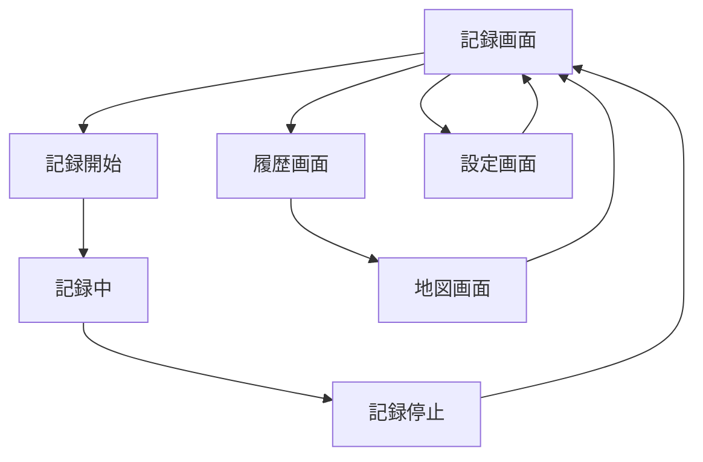

# Pathly MVP UI/UX設計

## 概要

Jetpack Composeを使用したAndroid MVPアプリのUI設計。
GPS記録・履歴表示・地図表示・基本設定の4つの機能を提供する。

## 🗺️ ナビゲーション構成

### タブナビゲーション（BottomNavigationBar）

```text
┌─────────────────────────────┐
│          Pathly             │ ← TopAppBar
├─────────────────────────────┤
│                             │
│        メインコンテンツ        │
│                             │
├─────────────────────────────┤
│ [記録] [履歴] [地図] [設定]   │ ← BottomNavigationBar
└─────────────────────────────┘
```

### タブ構成

| タブ | アイコン | 機能             | 優先度 |
| ---- | -------- | ---------------- | ------ |
| 記録 | 🎯        | GPS記録開始/停止 | 高     |
| 履歴 | 📅        | 過去の記録一覧   | 高     |
| 地図 | 🗺️        | 軌跡の地図表示   | 高     |
| 設定 | ⚙️        | 基本設定         | 中     |

## 📱 画面設計詳細

### 1. 記録画面（メイン画面）

**目的**: GPS記録の開始・停止・状態表示

```text
┌─────────────────────────────┐
│          記録               │
├─────────────────────────────┤
│                             │
│    ⏸️ 記録中 12:34:56        │ ← 記録状態表示
│                             │
│    📍 現在地: 渋谷駅前        │ ← 現在地表示（簡易）
│    📏 距離: 2.1km            │ ← リアルタイム距離
│                             │
│        ┌─────────┐           │
│        │   🛑    │           │ ← 記録開始/停止ボタン
│        │  停止   │           │   （大きなボタン）
│        └─────────┘           │
│                             │
├─────────────────────────────┤
│ [記録] [履歴] [地図] [設定]   │
└─────────────────────────────┘
```

#### コンポーネント構成

```kotlin
@Composable
fun TrackingScreen() {
    Column {
        TrackingStatusCard()  // 記録状態・距離表示
        Spacer()
        TrackingButton()      // 開始/停止ボタン
        CurrentLocationCard() // 現在地表示（オプション）
    }
}
```

#### 状態管理

- **記録中**: ボタン = 停止、ステータス = 時間・距離表示
- **停止中**: ボタン = 開始、ステータス = 待機状態

### 2. 履歴画面

**目的**: 過去のGPS記録を日付順で一覧表示

```text
┌─────────────────────────────┐
│          履歴               │
├─────────────────────────────┤
│                             │
│ 📅 2024/01/15 14:30         │ ← 記録アイテム
│    📏 3.2km ⏱️ 1h 20m        │   （タップで詳細）
│    📍 渋谷→新宿              │
│ ──────────────────────────── │
│ 📅 2024/01/14 10:15         │
│    📏 1.8km ⏱️ 45m           │
│    📍 原宿→表参道            │
│ ──────────────────────────── │
│ 📅 2024/01/13 16:45         │
│    📏 2.5km ⏱️ 1h 5m         │
│    📍 池袋→新宿              │
│                             │
├─────────────────────────────┤
│ [記録] [履歴] [地図] [設定]   │
└─────────────────────────────┘
```

#### コンポーネント構成

```kotlin
@Composable
fun HistoryScreen() {
    LazyColumn {
        items(tracks) { track ->
            TrackHistoryItem(
                track = track,
                onClick = { /* 詳細画面に遷移 */ }
            )
        }
    }
}
```

#### リストアイテム設計

- **日付・時刻**: 記録開始時刻
- **統計情報**: 距離・時間
- **場所情報**: 開始→終了地点（簡易表示）
- **タップアクション**: 地図画面で該当軌跡を表示

### 3. 地図画面

**目的**: Google Maps上での軌跡表示

```text
┌─────────────────────────────┐
│          地図               │
├─────────────────────────────┤
│                             │
│        Google Maps          │ ← 地図表示エリア
│    ～～～～～軌跡線～～～～～    │   （青い線で軌跡）
│   📍(開始)      📍(終了)     │   （開始・終了マーカー）
│                             │
│ ┌─────────────────────────┐ │
│ │選択中: 2024/01/15 渋谷→新宿│ │ ← 軌跡選択カード
│ │📏 3.2km ⏱️ 1h 20m        │ │   （下部オーバーレイ）
│ └─────────────────────────┘ │
│                             │
├─────────────────────────────┤
│ [記録] [履歴] [地図] [設定]   │
└─────────────────────────────┘
```

#### コンポーネント構成

```kotlin
@Composable
fun MapScreen() {
    Box {
        GoogleMap {
            // 軌跡のPolyline表示
            // 開始・終了マーカー
        }
        TrackSelectionCard() // 下部の軌跡選択UI
    }
}
```

#### 機能要件

- **軌跡表示**: 青色のPolylineで描画
- **マーカー**: 開始地点（緑）・終了地点（赤）
- **地図操作**: ズーム・パン・軌跡全体表示
- **軌跡選択**: 履歴からの軌跡切り替え

### 4. 設定画面

**目的**: GPS精度・記録設定の基本管理

```text
┌─────────────────────────────┐
│          設定               │
├─────────────────────────────┤
│                             │
│ 📍 GPS設定                   │
│   GPS精度      [バランス▼]   │ ← ドロップダウン
│   記録間隔      [30秒▼]      │
│                             │
│ 📱 アプリ設定                │
│   記録の自動開始  [OFF]       │ ← スイッチ
│   バックグラウンド [ON]       │
│                             │
│ 📊 データ管理                │
│   データ使用量   [2.1MB]      │ ← 表示のみ
│   [データを削除]             │ ← 危険ボタン
│                             │
│ ℹ️ アプリ情報                 │
│   バージョン    [1.0.0]      │
│   [ヘルプ]                   │
│                             │
├─────────────────────────────┤
│ [記録] [履歴] [地図] [設定]   │
└─────────────────────────────┘
```

#### コンポーネント構成

```kotlin
@Composable
fun SettingsScreen() {
    LazyColumn {
        item { SettingsSection("GPS設定") {
            GpsAccuracyDropdown()
            RecordingIntervalDropdown()
        }}
        item { SettingsSection("アプリ設定") {
            AutoStartSwitch()
            BackgroundSwitch()
        }}
        item { SettingsSection("データ管理") {
            DataUsageDisplay()
            DeleteDataButton()
        }}
    }
}
```

## 🎨 デザインシステム

### カラーパレット

```kotlin
// Primary Colors
val PrimaryBlue = Color(0xFF2196F3)      // メインカラー
val PrimaryDark = Color(0xFF1976D2)      // ダークブルー
val Accent = Color(0xFF03DAC6)           // アクセントカラー

// Status Colors  
val TrackingGreen = Color(0xFF4CAF50)    // 記録中
val StoppedGray = Color(0xFF9E9E9E)      // 停止中
val ErrorRed = Color(0xFFF44336)         // エラー・削除

// Map Colors
val TrackLineBlue = Color(0xFF2196F3)    // 軌跡線
val StartMarkerGreen = Color(0xFF4CAF50) // 開始地点
val EndMarkerRed = Color(0xFFF44336)     // 終了地点
```

### タイポグラフィ

```kotlin
// 見出し
headlineLarge: 24sp, Bold
headlineMedium: 20sp, Bold

// 本文
bodyLarge: 16sp, Regular     // 通常テキスト
bodyMedium: 14sp, Regular    // 補助テキスト
bodySmall: 12sp, Regular     // キャプション

// ボタン
labelLarge: 16sp, Medium     // 主要ボタン
labelMedium: 14sp, Medium    // 副次ボタン
```

### コンポーネントサイズ

```kotlin
// ボタンサイズ
val LargeButtonHeight = 64.dp        // 記録開始/停止
val MediumButtonHeight = 48.dp       // 通常ボタン
val SmallButtonHeight = 36.dp        // 小さなボタン

// スペーシング
val SpacingXLarge = 32.dp
val SpacingLarge = 24.dp
val SpacingMedium = 16.dp
val SpacingSmall = 8.dp

// カードサイズ
val CardElevation = 4.dp
val CardCornerRadius = 8.dp
```

## 🔄 画面遷移フロー

### 基本フロー



### 詳細遷移

1. **記録画面 → 履歴画面**: タブタップ
2. **履歴画面 → 地図画面**: 記録アイテムタップ
3. **地図画面 → 履歴画面**: バックボタン
4. **設定画面**: 独立したタブ

## 📏 レスポンシブ対応

### 画面サイズ対応

```kotlin
// Compact: スマートフォン縦持ち
@Composable
fun CompactLayout() {
    // BottomNavigationBar
    // 縦スクロール優先
}

// Medium: タブレット・横持ち（将来対応）
@Composable  
fun MediumLayout() {
    // NavigationRail（左サイドバー）
    // 2カラムレイアウト
}
```

## 🚀 実装優先順位

### Phase 1: MVP実装

1. **記録画面** - GPS記録機能の基本UI
2. **履歴画面** - データベースからの一覧表示
3. **BottomNavigationBar** - タブ切り替え

### Phase 2: 地図機能

4. **地図画面** - Google Maps SDK連携
5. **軌跡表示** - Polyline描画

### Phase 3: 設定機能

6. **設定画面** - 基本的な設定項目

## 💡 実装のポイント

### Jetpack Compose実装

```kotlin
// メインアクティビティ構成例
@Composable
fun PathlyApp() {
    val navController = rememberNavController()

    Scaffold(
        topBar = { PathlyTopBar() },
        bottomBar = { 
            PathlyBottomNavigation(navController) 
        }
    ) { paddingValues ->
        PathlyNavGraph(
            navController = navController,
            modifier = Modifier.padding(paddingValues)
        )
    }
}
```

### 状態管理

- **記録状態**: `TrackingViewModel`でStateFlow管理
- **履歴データ**: `HistoryViewModel`でFlow使用  
- **地図状態**: `MapViewModel`で軌跡選択管理

### パフォーマンス考慮

- **LazyColumn**: 履歴一覧の大量データ対応
- **remember**: 地図状態の保持
- **CompositionLocal**: テーマ・設定の共有

---

この設計をベースに、段階的にUI実装を進めることができます。
まずは記録画面とBottomNavigationBarから実装開始することを推奨します。
