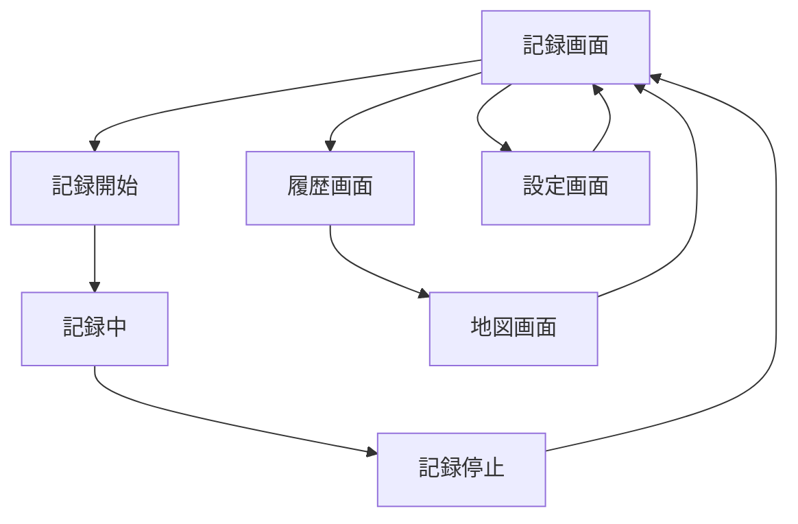

# Pathly MVP UI/UX設計

## 概要

Jetpack Composeを使用したAndroid MVPアプリのUI設計。
**現在実装済み**: GPS記録・履歴表示・地図表示（TrackDetailScreen内）
**Phase 2以降**: 独立した地図画面・設定画面

## 🎯 現在のMVP実装状況（2025/01現在）

### ✅ 実装完了

- **記録画面**: GPS記録開始/停止、リアルタイム位置表示
- **履歴画面**: 過去記録の一覧表示、削除機能
- **詳細画面**: GPS軌跡の地図表示（Google Maps連携）
- **BottomNavigationBar**: 記録・履歴タブ切り替え
- **権限管理**: 位置情報権限の要求・管理

### 🔄 UI改善提案（本ドキュメントの主要更新内容）

1. **カスタムカラーパレット**: 現在のPurple系から暖色系へ
2. **アイコン強化**: Material Iconsの活用
3. **アニメーション追加**: トランジション効果
4. **統計情報可視化**: 簡単なチャート表示
5. **ダークモード最適化**: カスタムカラーでの調整

## 🗺️ ナビゲーション構成

### タブナビゲーション（BottomNavigationBar）

```text
┌─────────────────────────────┐
│          Pathly             │ ← TopAppBar
├─────────────────────────────┤
│                             │
│        メインコンテンツ        │
│                             │
├─────────────────────────────┤
│ [記録] [履歴] [地図] [設定]   │ ← BottomNavigationBar
└─────────────────────────────┘
```

### タブ構成

| タブ | アイコン | 機能             | 優先度 |
| ---- | -------- | ---------------- | ------ |
| 記録 | 🎯        | GPS記録開始/停止 | 高     |
| 履歴 | 📅        | 過去の記録一覧   | 高     |
| 地図 | 🗺️        | 軌跡の地図表示   | 高     |
| 設定 | ⚙️        | 基本設定         | 中     |

## 📱 画面設計詳細

### 1. 記録画面（メイン画面）

**目的**: GPS記録の開始・停止・状態表示

```text
┌─────────────────────────────┐
│          記録               │
├─────────────────────────────┤
│                             │
│    ⏸️ 記録中 12:34:56        │ ← 記録状態表示
│                             │
│    📍 現在地: 渋谷駅前        │ ← 現在地表示（簡易）
│    📏 距離: 2.1km            │ ← リアルタイム距離
│                             │
│        ┌─────────┐           │
│        │   🛑    │           │ ← 記録開始/停止ボタン
│        │  停止   │           │   （大きなボタン）
│        └─────────┘           │
│                             │
├─────────────────────────────┤
│ [記録] [履歴] [地図] [設定]   │
└─────────────────────────────┘
```

#### コンポーネント構成

```kotlin
@Composable
fun TrackingScreen() {
    Column {
        TrackingStatusCard()  // 記録状態・距離表示
        Spacer()
        TrackingButton()      // 開始/停止ボタン
        CurrentLocationCard() // 現在地表示（オプション）
    }
}
```

#### 状態管理

- **記録中**: ボタン = 停止、ステータス = 時間・距離表示
- **停止中**: ボタン = 開始、ステータス = 待機状態

### 2. 履歴画面

**目的**: 過去のGPS記録を日付順で一覧表示

```text
┌─────────────────────────────┐
│          履歴               │
├─────────────────────────────┤
│                             │
│ 📅 2024/01/15 14:30         │ ← 記録アイテム
│    📏 3.2km ⏱️ 1h 20m        │   （タップで詳細）
│    📍 渋谷→新宿              │
│ ──────────────────────────── │
│ 📅 2024/01/14 10:15         │
│    📏 1.8km ⏱️ 45m           │
│    📍 原宿→表参道            │
│ ──────────────────────────── │
│ 📅 2024/01/13 16:45         │
│    📏 2.5km ⏱️ 1h 5m         │
│    📍 池袋→新宿              │
│                             │
├─────────────────────────────┤
│ [記録] [履歴] [地図] [設定]   │
└─────────────────────────────┘
```

#### コンポーネント構成

```kotlin
@Composable
fun HistoryScreen() {
    LazyColumn {
        items(tracks) { track ->
            TrackHistoryItem(
                track = track,
                onClick = { /* 詳細画面に遷移 */ }
            )
        }
    }
}
```

#### リストアイテム設計

- **日付・時刻**: 記録開始時刻
- **統計情報**: 距離・時間
- **場所情報**: 開始→終了地点（簡易表示）
- **タップアクション**: 地図画面で該当軌跡を表示

### 3. 地図画面

**目的**: Google Maps上での軌跡表示

```text
┌─────────────────────────────┐
│          地図               │
├─────────────────────────────┤
│                             │
│        Google Maps          │ ← 地図表示エリア
│    ～～～～～軌跡線～～～～～    │   （青い線で軌跡）
│   📍(開始)      📍(終了)     │   （開始・終了マーカー）
│                             │
│ ┌─────────────────────────┐ │
│ │選択中: 2024/01/15 渋谷→新宿│ │ ← 軌跡選択カード
│ │📏 3.2km ⏱️ 1h 20m        │ │   （下部オーバーレイ）
│ └─────────────────────────┘ │
│                             │
├─────────────────────────────┤
│ [記録] [履歴] [地図] [設定]   │
└─────────────────────────────┘
```

#### コンポーネント構成

```kotlin
@Composable
fun MapScreen() {
    Box {
        GoogleMap {
            // 軌跡のPolyline表示
            // 開始・終了マーカー
        }
        TrackSelectionCard() // 下部の軌跡選択UI
    }
}
```

#### 機能要件

- **軌跡表示**: 青色のPolylineで描画
- **マーカー**: 開始地点（緑）・終了地点（赤）
- **地図操作**: ズーム・パン・軌跡全体表示
- **軌跡選択**: 履歴からの軌跡切り替え

### 4. 設定画面

**目的**: GPS精度・記録設定の基本管理

```text
┌─────────────────────────────┐
│          設定               │
├─────────────────────────────┤
│                             │
│ 📍 GPS設定                   │
│   GPS精度      [バランス▼]   │ ← ドロップダウン
│   記録間隔      [30秒▼]      │
│                             │
│ 📱 アプリ設定                │
│   記録の自動開始  [OFF]       │ ← スイッチ
│   バックグラウンド [ON]       │
│                             │
│ 📊 データ管理                │
│   データ使用量   [2.1MB]      │ ← 表示のみ
│   [データを削除]             │ ← 危険ボタン
│                             │
│ ℹ️ アプリ情報                 │
│   バージョン    [1.0.0]      │
│   [ヘルプ]                   │
│                             │
├─────────────────────────────┤
│ [記録] [履歴] [地図] [設定]   │
└─────────────────────────────┘
```

#### コンポーネント構成

```kotlin
@Composable
fun SettingsScreen() {
    LazyColumn {
        item { SettingsSection("GPS設定") {
            GpsAccuracyDropdown()
            RecordingIntervalDropdown()
        }}
        item { SettingsSection("アプリ設定") {
            AutoStartSwitch()
            BackgroundSwitch()
        }}
        item { SettingsSection("データ管理") {
            DataUsageDisplay()
            DeleteDataButton()
        }}
    }
}
```

## 🎨 デザインシステム

### カラーパレット

#### 🆕 改善提案: 暖色系パレット（お出掛けアプリらしい親しみやすい色調）

```kotlin
// Primary Colors (改善提案)
val PathlyOrange = Color(0xFFFF6B35)     // メインオレンジ（お出掛け感）
val PathlyDarkOrange = Color(0xFFE55A2B) // ダークオレンジ
val PathlyGreen = Color(0xFF2ECC71)      // アクセントグリーン（自然・健康）
val PathlyLightGreen = Color(0xFF58D68D) // ライトグリーン

// Status Colors
val TrackingActive = Color(0xFF27AE60)   // 記録中（グリーン）
val TrackingInactive = Color(0xFF95A5A6) // 停止中（グレー）
val ErrorRed = Color(0xFFE74C3C)         // エラー・削除

// Map Colors
val TrackLineOrange = Color(0xFFFF6B35)  // 軌跡線（オレンジ）
val StartMarkerGreen = Color(0xFF2ECC71) // 開始地点（グリーン）
val EndMarkerRed = Color(0xFFE74C3C)     // 終了地点（レッド）

// Surface Colors
val SurfaceWarm = Color(0xFFFDF6F0)      // 暖かい背景色
val SurfaceVariantWarm = Color(0xFFF8EDE3) // 暖かいカード背景
```

#### 📱 現在の実装（Material3 Dynamic Color）

```kotlin
// Current implementation in Theme.kt
private val DarkColorScheme = darkColorScheme(
  primary = Purple80,    // → PathlyOrange に変更提案
  secondary = PurpleGrey80,
  tertiary = Pink80,
)

private val LightColorScheme = lightColorScheme(
  primary = Purple40,    // → PathlyOrange に変更提案
  secondary = PurpleGrey40,
  tertiary = Pink40,
)
```

### タイポグラフィ

```kotlin
// 見出し
headlineLarge: 24sp, Bold
headlineMedium: 20sp, Bold

// 本文
bodyLarge: 16sp, Regular     // 通常テキスト
bodyMedium: 14sp, Regular    // 補助テキスト
bodySmall: 12sp, Regular     // キャプション

// ボタン
labelLarge: 16sp, Medium     // 主要ボタン
labelMedium: 14sp, Medium    // 副次ボタン
```

### コンポーネントサイズ

```kotlin
// ボタンサイズ
val LargeButtonHeight = 64.dp        // 記録開始/停止
val MediumButtonHeight = 48.dp       // 通常ボタン
val SmallButtonHeight = 36.dp        // 小さなボタン

// スペーシング
val SpacingXLarge = 32.dp
val SpacingLarge = 24.dp
val SpacingMedium = 16.dp
val SpacingSmall = 8.dp

// カードサイズ
val CardElevation = 4.dp
val CardCornerRadius = 8.dp
```

## 🔄 画面遷移フロー

### 基本フロー



### 詳細遷移

1. **記録画面 → 履歴画面**: タブタップ
2. **履歴画面 → 地図画面**: 記録アイテムタップ
3. **地図画面 → 履歴画面**: バックボタン
4. **設定画面**: 独立したタブ

## 📏 レスポンシブ対応

### 画面サイズ対応

```kotlin
// Compact: スマートフォン縦持ち
@Composable
fun CompactLayout() {
    // BottomNavigationBar
    // 縦スクロール優先
}

// Medium: タブレット・横持ち（将来対応）
@Composable
fun MediumLayout() {
    // NavigationRail（左サイドバー）
    // 2カラムレイアウト
}
```

## 🚀 実装優先順位

### ✅ Phase 1: MVP実装（完了済み）

1. ✅ **記録画面** - GPS記録機能の基本UI
2. ✅ **履歴画面** - データベースからの一覧表示
3. ✅ **BottomNavigationBar** - タブ切り替え
4. ✅ **地図表示** - TrackDetailScreen内でGoogle Maps SDK連携・Polyline描画

### 🎨 Phase 2: UI改善（次のフェーズ）

**優先度高**

1. **カスタムカラーパレット導入** - Purple系→暖色系への変更
2. **アイコン強化** - 記録開始/停止ボタンのアイコン追加
3. **TrackingScreen レイアウト改善** - より視覚的に分かりやすい記録状態表示

**優先度中**
4. **アニメーション追加** - 記録開始/停止時のトランジション
5. **統計情報の可視化** - 簡単なチャート（週次/月次サマリー）
6. **地図表示強化** - より良いマーカーデザイン、軌跡の色分け

### 🚀 Phase 3: 機能拡張（将来実装）

1. **独立した地図画面** - 全軌跡表示・軌跡選択UI
2. **設定画面** - GPS精度・記録間隔の設定
3. **ダークモード最適化** - カスタムカラーでの調整
4. **インタラクティブ要素** - Pull-to-refresh、スワイプアクション

## 💡 実装のポイント

### 📱 現在の実装構成（MainActivity.kt）

```kotlin
// 実際の実装（Jetpack Navigation不使用、シンプルなState管理）
@Composable
private fun MainScreen(onRequestPermission: () -> Unit) {
    var selectedTab by remember { mutableStateOf(BottomNavItem.TRACKING) }
    var selectedTrack by remember { mutableStateOf<GpsTrack?>(null) }

    Scaffold(
        bottomBar = {
            if (selectedTrack == null) {  // 詳細画面では非表示
                NavigationBar {
                    BottomNavItem.entries.forEach { item ->
                        NavigationBarItem(
                            selected = selectedTab == item,
                            onClick = { selectedTab = item },
                            label = { Text(item.title) },
                            icon = { Icon(item.icon, contentDescription = item.title) }
                        )
                    }
                }
            }
        }
    ) { innerPadding ->
        when {
            selectedTrack != null -> TrackDetailScreen(...)  // 詳細画面
            selectedTab == BottomNavItem.TRACKING -> TrackingScreen(...)
            selectedTab == BottomNavItem.HISTORY -> HistoryScreen(...)
        }
    }
}

// 現在のタブ構成（2タブのみ）
enum class BottomNavItem(val title: String, val icon: ImageVector) {
    TRACKING("記録", Icons.Filled.PlayArrow),     // 🎯 → 記録アイコン変更提案
    HISTORY("履歴", Icons.AutoMirrored.Filled.List), // 📅 → 履歴アイコン変更提案
}
```

### 🎨 UI改善提案の具体的実装

#### 1. アイコン改善提案

```kotlin
// 現在 → 提案
TRACKING("記録", Icons.Filled.PlayArrow),        // → Icons.Filled.LocationOn
HISTORY("履歴", Icons.AutoMirrored.Filled.List), // → Icons.Filled.History
```

#### 2. 記録ボタンのアイコン化

```kotlin
// TrackingScreen.kt の改善提案
Button(
    onClick = onStartTracking,
    modifier = Modifier.size(width = 200.dp, height = 60.dp)
) {
    Row(verticalAlignment = Alignment.CenterVertically) {
        Icon(Icons.Filled.PlayArrow, contentDescription = null)  // 🆕
        Spacer(modifier = Modifier.width(8.dp))
        Text("記録開始", style = MaterialTheme.typography.titleMedium)
    }
}
```

### 状態管理

- **記録状態**: `TrackingViewModel`でStateFlow管理
- **履歴データ**: `HistoryViewModel`でFlow使用
- **地図状態**: `MapViewModel`で軌跡選択管理

### パフォーマンス考慮

- **LazyColumn**: 履歴一覧の大量データ対応
- **remember**: 地図状態の保持
- **CompositionLocal**: テーマ・設定の共有

## 📋 次のアクションプラン

### 🎯 即座に実装可能（Phase 2優先度高）

1. **カラーパレット変更**
   - `Color.kt`: 新しい暖色系カラー定義
   - `Theme.kt`: LightColorScheme/DarkColorScheme更新

2. **アイコン改善**
   - `MainActivity.kt`: BottomNavItemのアイコン変更
   - `TrackingScreen.kt`: 記録開始/停止ボタンにアイコン追加

3. **TrackingScreen UI改善**
   - 記録状態カードのデザイン強化
   - より視覚的に分かりやすいレイアウト

### 🔄 段階的実装（Phase 2優先度中）

1. **アニメーション追加**: 記録開始/停止時のスムーズなトランジション
2. **統計情報**: 週次/月次の簡単なサマリー表示
3. **地図強化**: マーカーデザイン改善、軌跡の色分け

---

## 📝 更新履歴

**2025/01/09**:

- MVP実装完了を反映
- UI改善提案を具体的に追加
- 現在の実装状況との差分を明確化
- 次のフェーズの実装優先順位を整理
