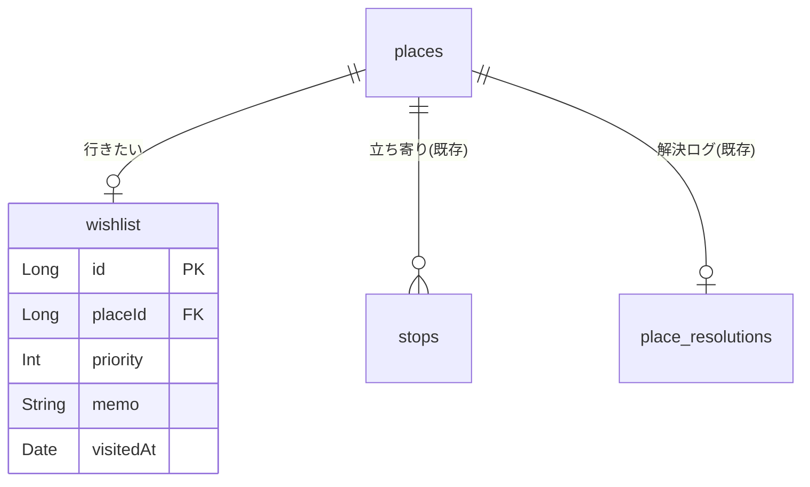

# 行きたい場所（wishlist）の設計

これから行きたい場所を **登録・一覧・整理** できるようにする設計。
既存の場所（`places`）を再利用し、「まだ訪れていない場所」も「また行きたい場所」も同じ土台で扱う。

- 関連要望（[requirements.md](../requirements.md) の「計画」）
  - 行きたい場所をリストアップしたい
  - 場所の詳細情報（住所・営業時間など）を登録したい
  - 行きたい場所に優先度を設定したい
- 前提: 「場所（place）は経路と独立して永続する」という [places-and-stops.md](./places-and-stops.md) の設計に乗る。
  行きたい場所は **「stops を持たない place ＋ wishlist の1行」** として表現する。
- データモデル（`places` / `place_resolutions`）は [../specs/model.md](../specs/model.md) を参照。

> **マイルストーン注記**: 本来 [roadmap.md](../roadmap.md) の Phase 3（事前の計画）だが、先行して着手する。
> Phase 2（写真・評価・タグ等）とは独立に実装でき、既存 DB を壊さず追加できる。

---

## 方針

### なぜ places とは別に wishlist テーブルを持つのか

[places-and-stops.md](./places-and-stops.md) の設計では **places を静的に保ち、動的な状態は別テーブルに分離**している
（例: Google 解決の状態は `place_resolutions` に分離）。行きたい場所の「優先度・メモ・訪問済み状態」も
**場所そのものではなく、ユーザーの計画に属する動的な情報**なので、`places` に列を足さず `wishlist` テーブルに分離する。

```
places 1 ──< stops        （立ち寄り＝過去の訪問）
       1 ──o wishlist      （行きたい＝これからの計画）  ← 本書が追加
       1 ──o place_resolutions （Google 解決ログ）
```

- 1つの place は wishlist に **最大1件**（`placeId` に UNIQUE）。同じ場所を二重登録しない。
- 立ち寄りで検出済みの place を「また行きたい」に足す場合も、既存 place を再利用して wishlist 行を足すだけ。

### タグ（初回スコープ外・後回し）

要望（[requirements.md](../requirements.md)）にあるのは「**タグ付けで整理したい（複数・目的別）**」のみで、
「カテゴリ」という別概念は存在しない。用語は **「タグ」に統一**する。

初回スコープでは **タグを実装しない**。理由:

- 要望は複数タグ（「グルメ」「観光」など目的別に絞り込む）で、1件だけ選べる単一値では要望を満たせない。
- 複数タグは `tags` / `wishlist_tags`（多対多）を要し、記録側の `stop_tags`（[CLAUDE.md] の想定）とも
  共有すべき横断機能。行きたい場所の登録を先行させる今回の主旨からは切り離し、**後段でまとめて実装**する。

初回は優先度・メモ・訪問済み状態で計画用途は成立する。タグは段階リリースの後半（[段階リリース](#段階リリース)）で
`tags` を共有する形で追加する。

### 訪問済み状態

`visitedAt`（NULL=未訪問 / 日時=訪問済み）で持つ。初回は **手動トグル**。
将来は、記録中/再解析で検出した `stops` の場所が wishlist の place と一致したら
**自動で `visitedAt` を立てる**（計画と実績のひも付け）。DB は分離済みなので後付けできる。

---

## データモデル

実装は Long 主キー（`autoGenerate`）。既存の `places` / `place_resolutions` に合わせる。

### wishlist テーブル

| カラム    | 型      | 制約                            | 説明                               |
| --------- | ------- | ------------------------------- | ---------------------------------- |
| id        | INTEGER | PK AUTOINCREMENT                | 行きたい場所ID                     |
| placeId   | INTEGER | NOT NULL, UNIQUE, FK→places(id) | どの場所か（1 place につき1件）    |
| priority  | INTEGER | NOT NULL, DEFAULT 1             | 優先度（0=低 / 1=中 / 2=高）       |
| memo      | TEXT    | NULL                            | メモ・コメント（なぜ行きたいか等） |
| visitedAt | INTEGER | NULL                            | 訪問済み日時（NULL=未訪問）        |
| createdAt | INTEGER | NOT NULL                        | 作成日時                           |
| updatedAt | INTEGER | NOT NULL                        | 更新日時                           |

- インデックス: `wishlist(placeId)` は UNIQUE（重複登録の防止＋find-or-add に使う）。
- 外部キー: `wishlist.placeId → places.id ON DELETE CASCADE`（place を消したら wishlist 行も消える）。
  - ただし通常フローで place を消すことはない（places は再利用のため静的に保つ）。
- 名前・座標・住所は `places` 側に持つ（wishlist は持たない）。表示時に JOIN する。

### ER 図（[../specs/model.md](../specs/model.md) への追加分）



---

## ドメインモデル

- `WishlistItem` … 行きたい場所1件。`place: Place`（座標・名前・住所）＋計画情報（優先度・メモ・訪問済み）。
  - 表示名は `place.name`（未命名は住所→座標の順でフォールバック）。
- `Priority` … `LOW / MEDIUM / HIGH` の enum（DB では 0/1/2）。

```
WishlistItem
 ├─ place: Place        （id・name?・lat・lng・address?）
 ├─ priority: Priority
 ├─ memo: String?
 └─ visitedAt: Date?    （null=未訪問）
```

---

## 登録の3経路

いずれも最終的に **place を find-or-create（30m 重複排除）→ wishlist 行を作成** に集約する。
既に wishlist にある place なら重複させず既存行を開く。

### 1. キーワード検索で登録（オンライン・課金あり）

店名などで検索して選ぶ。Google から名前・住所・座標・`googlePlaceId` を取得できる。

1. 検索欄にキーワード入力 → **候補（Autocomplete）** を表示。
2. 候補を選択 → **`fetchPlace`** で `DISPLAY_NAME / FORMATTED_ADDRESS / LAT_LNG / ID` を取得。
3. 座標で `findOrCreatePlace`（30m）→ place に name/address を保存。
   `googlePlaceId` が取れているので **`place_resolutions` に解決済み行を記録**（Nearby を叩き直さない）。
4. wishlist 行を作成（優先度・メモを任意入力）。

- **課金最小化**（[places-and-stops.md](./places-and-stops.md) と同じ思想）:
  - **Autocomplete はセッショントークン**でまとめ、確定した1件だけ `fetchPlace` する。
  - オフライン時は検索経路を無効化（手動入力・地図タップに誘導）。
- 実装: 既存 `PlacesNameResolver`（Nearby 専用）とは別に、テキスト検索用の呼び出しを足す
  （`PlacesTextSearcher` など。`AutocompleteSessionToken` ＋ `FindAutocompletePredictionsRequest` ＋ `FetchPlaceRequest`）。

### 2. 地図をタップして登録（オフライン可）

地図上の任意地点を選んで座標で登録する。名前は後から。

1. 全画面マップで地点をタップ（またはロングプレス）→ ピンを置く。
2. `findOrCreatePlace`（30m）→ place を作成（name は null）。
3. wishlist 行を作成（優先度・メモを任意入力）。
4. 名前は後で **手動入力**、またはオンライン時に **「場所を取得」**（座標中心の Nearby ＝ 既存 `PlacesNameResolver.resolve` を再利用）で命名。

### 3. 立ち寄り場所から登録（また行きたい）

> [requirements.md](../requirements.md) に「訪れた場所を『また行きたい』としてワンタップで追加したい」を追記済み（2026-07-26）。
> 振り返り（Phase 2）→計画の橋渡し。実装は段階リリースの後段（段階4）。

1. 詳細画面（[../specs/screens.md](../specs/screens.md) の立ち寄り一覧）の各行に **「また行きたい」** を追加。
2. その stop の place（既存）に対し wishlist 行を作成（無ければ）。既にあれば「登録済み」を示す。

---

## UI

ボトムナビに **「行きたい」タブを新設**（現状 3 タブ → 4 タブ）。
将来の「計画」タブ（Phase 3）の前身になる。map-first 方針は踏襲しつつ、一覧が主役の計画向け画面にする。

### ナビゲーション

| タブ         | 機能                         | アイコン（新規）          |
| ------------ | ---------------------------- | ------------------------- |
| 記録         | 全画面マップ＋GPS記録        | `ic_location_on`          |
| 履歴         | 過去記録の一覧・統計         | `ic_list`                 |
| **行きたい** | **行きたい場所の一覧・登録** | **`ic_flag`（新規追加）** |
| 設定         | GPS記録間隔などの設定        | `ic_settings`             |

> アイコンは Material Icons 不使用のため `res/drawable` にベクター（`ic_flag` 等）を追加し `painterResource` で使う（[CLAUDE.md] 準拠）。

### 1. 行きたい一覧画面

```text
┌─────────────────────────────┐
│ 行きたい場所            (＋) │ ← 右上: 追加ボタン
│ [未訪問] [訪問済み]          │ ← 状態フィルタ
│ ┌─────────────────────────┐ │
│ │ ★★★ ◯◯カフェ            │ │ ← 優先度・名前
│ │ 東京都… / メモ抜粋…       │ │
│ └─────────────────────────┘ │
│ ┌─────────────────────────┐ │
│ │ ★☆☆ △△公園  ✓訪問済み  │ │
│ └─────────────────────────┘ │
├─────────────────────────────┤
│ [ 記録 ][ 履歴 ][行きたい][設定]│
└─────────────────────────────┘
```

- **並び替え**: 優先度（高→低）／登録日（新→古）。（距離順は現在地権限がある時のみ・将来）
- **フィルタ**: 未訪問/訪問済み。（タグでの絞り込みはタグ実装後に追加）
- **各行**: 優先度（★や色）・場所名（未命名は住所→座標）・メモ抜粋・訪問済みバッジ。
- **追加（＋）**: メニューで「検索して追加」「地図で選ぶ」「手入力」を選ぶ。
- 空のときは「行きたい場所がありません」＋追加導線。

### 2. 追加フロー

- **検索**: キーワード欄＋候補リスト（Autocomplete）。選択で詳細入力（優先度・メモ）→保存。
- **地図で選ぶ**: 全画面マップ、タップでピン→確定→詳細入力→保存。
- **手入力**: 名前（必須）・メモ・優先度。座標なしで保存可（後で地図/検索から補完）。

### 3. 行きたい詳細画面（map-first）

```text
┌─────────────────────────────┐
│ (←)                     (🗑) │
│        [全画面 Google Map]   │ ← place にピン（座標があれば）
│ ┌─────────────────────────┐ │
│ │ ═══                     │ │
│ │ ◯◯カフェ         [編集]  │ │
│ │ 優先度 ★★★               │ │
│ │ 住所: 東京都…            │ │
│ │ メモ: 期間限定メニュー…   │ │
│ │ [ 未訪問 ⇄ 訪問済み ]     │ │ ← トグル
│ │ [ 場所を取得 ] (未命名時)  │ │ ← 座標のみ登録の命名
│ └─────────────────────────┘ │
└─────────────────────────────┘
```

- 優先度・メモ・訪問済みを編集。削除は wishlist 行のみ削除（place は残す）。
- 未命名（座標のみ）の place は「場所を取得」で命名（既存の Nearby 解決を再利用）。
- **将来**: 営業時間表示、地図アプリでナビ起動、計画（お出掛け）への割り当て。

---

## アーキテクチャ・実装マップ

Clean Architecture（[architecture.md](./architecture.md)）に沿う。既存の Place 系実装を最大限再利用する。

| 要素               | ファイル（新規/変更）                                                                            |
| ------------------ | ------------------------------------------------------------------------------------------------ |
| Entity             | `data/local/entity/WishlistEntity.kt`（新規）／`WishlistWithPlace.kt`（JOIN 用）                 |
| DAO                | `data/local/dao/WishlistDao.kt`（新規）                                                          |
| マイグレーション   | `DatabaseMigrations.kt` に v4→v5 を追加（`wishlist` 作成）                                       |
| ドメインモデル     | `domain/model/WishlistItem.kt`, `Priority.kt`（新規）                                            |
| リポジトリ         | `domain/repository/WishlistRepository.kt` ／ `data/repository/WishlistRepositoryImpl.kt`（新規） |
| 場所同定（再利用） | 既存 `findOrCreatePlace`（`PlaceRepository`／`PlaceDao`）を共用                                  |
| キーワード検索     | `data/places/PlacesTextSearcher.kt`（新規・Autocomplete＋fetchPlace）                            |
| 名前解決（再利用） | 既存 `PlacesNameResolver.resolve`（地図タップ登録の命名）                                        |
| ViewModel          | `presentation/wishlist/WishlistViewModel.kt`（一覧）／追加・詳細用                               |
| 画面               | `presentation/wishlist/WishlistScreen.kt` ほか（一覧・追加・詳細）                               |
| ナビ               | `MainActivity` の `selectedTab` に「行きたい」を追加、`ic_flag` ベクター追加                     |
| DI                 | `di/` に `WishlistRepository` のバインド追加                                                     |

### リポジトリ・インターフェース（案）

```kotlin
interface WishlistRepository {
  /** 行きたい一覧（場所つき）をリアクティブに取得。フィルタ/並び替えは呼び出し側 or 引数で。 */
  fun getWishlist(): Flow<List<WishlistItem>>

  /** 既存 place（立ち寄り等）を行きたいに追加。既に有れば既存を返す（重複させない）。 */
  suspend fun addFromPlace(placeId: Long, priority: Priority, memo: String?): Long

  /** 座標から追加（地図タップ）。find-or-create(30m) して wishlist 行を作る。 */
  suspend fun addByCoordinate(lat: Double, lng: Double, name: String?, priority: Priority, memo: String?): Long

  /** Google 検索結果から追加（googlePlaceId 既知 → place_resolutions も記録）。 */
  suspend fun addFromSearchResult(result: PlaceSearchResult, priority: Priority, memo: String?): Long

  /** 手入力（座標なし可）から追加。 */
  suspend fun addManual(name: String, priority: Priority, memo: String?): Long

  suspend fun updateWishlist(id: Long, priority: Priority, memo: String?)
  suspend fun setVisited(id: Long, visited: Boolean)
  /** wishlist 行のみ削除（place は残す）。 */
  suspend fun remove(id: Long)
}
```

---

## 段階リリース

1. **DB＋ドメイン＋一覧（オフラインで完結）**: `wishlist` テーブル・DAO・マイグレーション、`WishlistItem`、一覧画面、
   「手入力」「地図タップ」で追加、優先度/メモ/訪問トグル、削除。**Google 不要で成立**。
2. **命名の再利用**: 座標のみ登録の place を既存「場所を取得」（Nearby）で命名。
3. **キーワード検索登録**: `PlacesTextSearcher`（Autocomplete＋fetchPlace・セッショントークン・オンライン限定）。
4. **立ち寄りから「また行きたい」**（要望追記後）: 詳細画面に導線を追加。
5. **タグ（複数）**: `tags` / `wishlist_tags` を追加し、一覧にタグ絞り込みを追加。記録側 `stop_tags` と共有する横断機能として設計。
6. **将来**: 訪問済みの自動判定（stops とのひも付け）、営業時間、計画（お出掛け）への割り当て、Phase 3 の「計画」タブへ発展。

いずれの段階でも、Google が使えなくても（手入力・地図タップで）アプリは成立する。

---

## 未確定・要検討

- **タグの設計**: 初回スコープ外。実装時に `tags`（固定候補＋自由入力か）・`wishlist_tags`・記録側 `stop_tags` との共有範囲を検討する。
- **優先度の表現**: 3段階（高/中/低）で確定。UI は ★3つ or 色。
- **手入力（座標なし）の地図表示**: 座標が無い行はマップにピンを出せない。一覧では出すが詳細のマップは非表示 or 検索補完を促す。
- **タブ増設の影響**: 4 タブでの下部ナビのレイアウト（ラベル/アイコンの収まり）を実機で確認。
