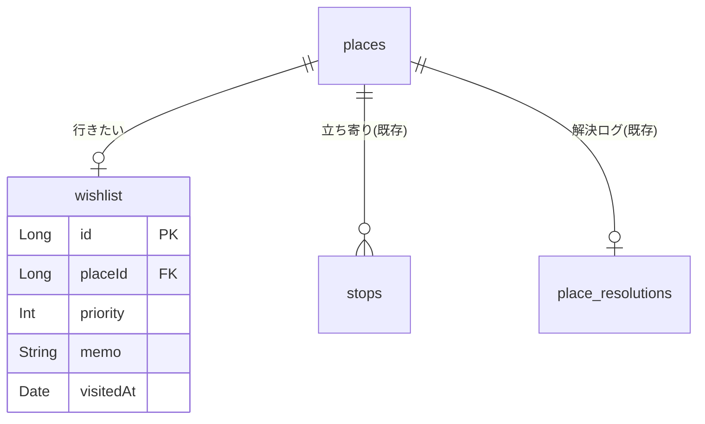

# 行きたい場所（wishlist）の設計

これから行きたい場所を **登録・一覧・整理** できるようにする設計。
既存の場所（`places`）を再利用し、「まだ訪れていない場所」も「また行きたい場所」も同じ土台で扱う。

- 関連要望（[requirements.md](../requirements.md) の「計画」）
  - 行きたい場所をリストアップしたい
  - 場所の詳細情報（住所・営業時間など）を登録したい
  - 行きたい場所に優先度を設定したい
- 前提: 「場所（place）は経路と独立して永続する」という [places-and-stops.md](./places-and-stops.md) の設計に乗る。
  行きたい場所は **「stops を持たない place ＋ wishlist の1行」** として表現する。
- データモデル（`places` / `place_resolutions`）は [../specs/model.md](../specs/model.md) を参照。

> **マイルストーン注記**: 本来 [roadmap.md](../roadmap.md) の Phase 3（事前の計画）だが、先行して着手する。
> Phase 2（写真・評価・タグ等）とは独立に実装でき、既存 DB を壊さず追加できる。

---

## 方針

### なぜ places とは別に wishlist テーブルを持つのか

[places-and-stops.md](./places-and-stops.md) の設計では **places を静的に保ち、動的な状態は別テーブルに分離**している
（例: Google 解決の状態は `place_resolutions` に分離）。行きたい場所の「優先度・メモ・訪問済み状態」も
**場所そのものではなく、ユーザーの計画に属する動的な情報**なので、`places` に列を足さず `wishlist` テーブルに分離する。

```
places 1 ──< stops        （立ち寄り＝過去の訪問）
       1 ──o wishlist      （行きたい＝これからの計画）  ← 本書が追加
       1 ──o place_resolutions （Google 解決ログ）
```

- 1つの place は wishlist に **最大1件**（`placeId` に UNIQUE）。同じ場所を二重登録しない。
- 立ち寄りで検出済みの place を「また行きたい」に足す場合も、既存 place を再利用して wishlist 行を足すだけ。

### タグ（初回スコープ外・後回し）

要望（[requirements.md](../requirements.md)）にあるのは「**タグ付けで整理したい（複数・目的別）**」のみで、
「カテゴリ」という別概念は存在しない。用語は **「タグ」に統一**する。

初回スコープでは **タグを実装しない**。理由:

- 要望は複数タグ（「グルメ」「観光」など目的別に絞り込む）で、1件だけ選べる単一値では要望を満たせない。
- 複数タグは `tags` / `wishlist_tags`（多対多）を要し、記録側の `stop_tags`（[CLAUDE.md] の想定）とも
  共有すべき横断機能。行きたい場所の登録を先行させる今回の主旨からは切り離し、**後段でまとめて実装**する。

初回は優先度・メモ・訪問済み状態で計画用途は成立する。タグは段階リリースの後半（[段階リリース](#段階リリース)）で
`tags` を共有する形で追加する。

### 訪問済み状態

**その場所に立ち寄り（stops）が1件以上あれば「訪問済み」**とする（一覧クエリで stops を COUNT）。
加えて wishlist の `visitedAt`（NULL=未訪問 / 日時=訪問済み）で**手動**でも訪問済みにできる。
`isVisited = 立ち寄りあり OR visitedAt != null`。立ち寄り記録のある場所は自動で訪問済みになる。

---

## データモデル

実装は Long 主キー（`autoGenerate`）。既存の `places` / `place_resolutions` に合わせる。

### wishlist テーブル

| カラム    | 型      | 制約                            | 説明                               |
| --------- | ------- | ------------------------------- | ---------------------------------- |
| id        | INTEGER | PK AUTOINCREMENT                | 行きたい場所ID                     |
| placeId   | INTEGER | NOT NULL, UNIQUE, FK→places(id) | どの場所か（1 place につき1件）    |
| priority  | INTEGER | NOT NULL, DEFAULT 1             | 優先度（0=低 / 1=中 / 2=高）       |
| memo      | TEXT    | NULL                            | メモ・コメント（なぜ行きたいか等） |
| visitedAt | INTEGER | NULL                            | 訪問済み日時（NULL=未訪問）        |
| createdAt | INTEGER | NOT NULL                        | 作成日時                           |
| updatedAt | INTEGER | NOT NULL                        | 更新日時                           |

- インデックス: `wishlist(placeId)` は UNIQUE（重複登録の防止＋find-or-add に使う）。
- 外部キー: `wishlist.placeId → places.id ON DELETE CASCADE`（place を消したら wishlist 行も消える）。
  - ただし通常フローで place を消すことはない（places は再利用のため静的に保つ）。
- 名前・座標・住所は `places` 側に持つ（wishlist は持たない）。表示時に JOIN する。

### ER 図（[../specs/model.md](../specs/model.md) への追加分）



---

## ドメインモデル

- `PlaceListItem` … 一覧の1行。`place: Place` ＋ 行きたい登録（あれば）＋ 立ち寄り件数。
  「行きたい」は任意の属性なので、**行きたい登録が無い場所も同じ型で並ぶ**（`wishlistId` が null）。
  - 表示名は `places.name`（自分の名前）→ `google_places.name` → 住所 → 座標 の順でフォールバック
    （[place-info-enrichment.md](./place-info-enrichment.md)）。
- `Priority` … `LOW / MEDIUM / HIGH` の enum（DB では 0/1/2）。

```
PlaceListItem
 ├─ place: Place        （id・name?・lat・lng・note?・googleName?・googleAddress?・category?）
 ├─ wishlistId: Long?   （null=行きたいに入っていない）
 ├─ priority: Priority?
 ├─ visitedAt: Date?    （null=未訪問）
 └─ visitCount: Int     （立ち寄り記録の件数）
```

> メモは v7 で `wishlist.memo` を廃し **`places.note`** に一本化した（行きたいに入れなくても
> 場所にメモを残せる）。住所も `places.address` から `google_places.address` へ移した。

---

## 登録の3経路

いずれも **place を find-or-create（30m 重複排除）で登録**するのが土台。「行きたい」は任意の属性で、
必要なときだけ wishlist 行を作る（既に登録済みの place なら重複させない）。
下記は登録の入口の一覧（実装済み: 1 キーワード検索・2 地図タップ・2b 記録画面POI。3 立ち寄りから は後段）。

### 1. キーワード検索で登録（オンライン・課金あり）

店名などで検索して選ぶ。Google から名前・住所・座標・`googlePlaceId` を取得できる。

1. 検索欄にキーワード入力 → **候補（Autocomplete）** を表示。
2. 候補を選択 → **`fetchPlace`** で `DISPLAY_NAME / FORMATTED_ADDRESS / LAT_LNG / ID` を取得。
3. `googlePlaceId` で `findOrCreateByGooglePlaceId`（施設の同一性で同定・[ADR-0006](../adr/0006-place-identity-by-googleplaceid.md)）
   → **`google_places` に名前・住所・カテゴリを保存**（`places.name` には書かない）。
   `place_resolutions` に解決済み行を記録して Nearby を叩き直さない。
   検索時点で取れている情報は `knownDetails` としてそのまま渡し、**登録で Google を引き直さない**。
4. wishlist 行を作成（優先度は任意・メモは `places.note`）。

- **課金最小化**（[places-and-stops.md](./places-and-stops.md) と同じ思想）:
  - **Autocomplete はセッショントークン**でまとめ、確定した1件だけ `fetchPlace` する。
  - オフライン時は検索経路を無効化（手動入力・地図タップに誘導）。
- 実装: 既存 `PlacesNameResolver`（Nearby 専用）とは別に、テキスト検索用の呼び出しを足す
  （`PlacesTextSearcher` など。`AutocompleteSessionToken` ＋ `FindAutocompletePredictionsRequest` ＋ `FetchPlaceRequest`）。

### 2. 地図をタップして登録（オフライン可）

地図上の任意地点を選んで座標で登録する。名前は後から。

1. 全画面マップで地点をタップ（またはロングプレス）→ ピンを置く。
2. `findOrCreatePlace`（30m）→ place を作成（name は null）。
3. wishlist 行を作成（優先度・メモを任意入力）。
4. 名前は後で **手動入力**、またはオンライン時に **「場所を取得」**（座標中心の Nearby ＝ 既存 `PlacesNameResolver.resolve` を再利用）で命名。

### 2b. マップ上の POI タップから登録（アプリ共通）

**地図はどこでも「場所を見つける面」**として扱い、施設アイコン（POI）をタップすると
共通の**場所シート**（名前・メモ・行きたい・優先度）を出す。

- 対応マップ: **記録画面／経路詳細（振り返り）／場所詳細**、および場所タブの「地図で選ぶ」「検索して追加」。
- `onPOIClick` で POI（名前・座標・`googlePlaceId`）→ 場所シート → `registerPlace`（＝地図タップと同じ）。
  行きたい ON なら `addToWishlist`（優先度は既定 MEDIUM）。
- 記録中でも使える。空きタップからも登録できる（画面 × モード別の一覧は
  [map-tap-behavior.md](./map-tap-behavior.md)）。
- シートは**非モーダル**（`FloatingSheet`）。スクリムを敷かないので出したまま地図を動かせる
  → [ADR-0010](../adr/0010-non-modal-map-sheets.md)。

対応実装: 共通 `presentation/places/PlaceActionSheet.kt`（入力欄は `PlacesScreen.kt` の
`PlaceFormBody` を共有）。登録の手順は `domain/usecase/PlaceEditUseCase` に集約し、
`TrackingViewModel` / `TrackDetailViewModel` / `PlacesViewModel` の3つから呼ぶ。

### 3. 立ち寄り場所から登録（また行きたい）

> [requirements.md](../requirements.md) に「訪れた場所を『また行きたい』としてワンタップで追加したい」を追記済み（2026-07-26）。
> 振り返り（Phase 2）→計画の橋渡し。実装は段階リリースの後段（段階4）。

1. 詳細画面（[../specs/screens.md](../specs/screens.md) の立ち寄り一覧）の各行に **「また行きたい」** を追加。
2. その stop の place（既存）に対し wishlist 行を作成（無ければ）。既にあれば「登録済み」を示す。

---

## UI

ボトムナビに **「場所」タブを新設**（現状 3 タブ → 4 タブ）。**登録済みの全ての場所（places）を一覧**し、
各場所に「行きたい」を付け外しできる。行きたいは場所の属性（トグル）として扱う。
将来の「計画」タブ（Phase 3）の前身になる。

### ナビゲーション

| タブ     | 機能                                 | アイコン（新規）           |
| -------- | ------------------------------------ | -------------------------- |
| 記録     | 全画面マップ＋GPS記録                | `ic_location_on`           |
| 履歴     | 過去記録の一覧・統計                 | `ic_list`                  |
| **場所** | **全ての場所を一覧・登録・行きたい** | **`ic_place`（新規追加）** |
| 設定     | GPS記録間隔などの設定                | `ic_settings`              |

> アイコンは Material Icons 不使用のため `res/drawable` にベクター（`ic_place`=タブ / `ic_flag`=行きたいフラグ）を追加し `painterResource` で使う（[CLAUDE.md] 準拠）。

### 1. 場所一覧画面

```text
┌─────────────────────────────┐
│ 場所                    (＋) │ ← 右上: 追加ボタン
│ [すべて] [行きたい] [訪問済み]│ ← フィルタ
│ ┌─────────────────────────┐ │
│ │ ◯◯カフェ            [🚩] │ │ ← 名前・行きたいフラグ(タップでON/OFF)
│ │ 行きたい ★★★ / メモ抜粋… │ │
│ └─────────────────────────┘ │
│ ┌─────────────────────────┐ │
│ │ △△公園  ✓訪問済み   [🚩] │ │
│ └─────────────────────────┘ │
├─────────────────────────────┤
│ [ 記録 ][ 履歴 ][ 場所 ][設定]│
└─────────────────────────────┘
```

- **一覧の範囲**: **全ての places**（立ち寄り検出で自動生成された場所も含む）。
- **並び替え**: 登録の新しい順（`createdAt DESC`・安定。行きたいトグルで並びが動かない）。
- **フィルタ**: すべて / 行きたい / 訪問済み（訪問済み＝立ち寄りあり or 手動）。
- **各行**: 場所名（未命名は住所→座標）・行きたいフラグ（タップで付け外し）・優先度（行きたい時）・メモ抜粋・訪問済みバッジ・削除アイコン。
- **追加（＋）**: 地図タップで登録（下記）。
- 空のときは「場所がありません」＋追加導線。

### 2. 追加フロー（地図タップ）

**全画面マップを土台にし、タップして初めて入力欄を出す**（マップを広く使う）。

1. 全画面マップ。未タップのうちは上部にヒントのみ（入力欄は出さない）。
2. **アイコン（POI）をタップ** → 施設名を見出しに出してピン。**何もない場所をタップ** → 見出しなしでピン。
3. タップ後に下部の**場所シート**が出る: 自分で付ける名前（任意）・メモ・**「行きたい」トグル**（ON時のみ優先度）。
4. **保存＝まず場所を登録**。行きたいトグルが ON のときだけ wishlist にも入れる。
   シートを閉じてタップし直せば選び直せる。

> 名前・座標は place 側に持つ。POI 名は `onPOIClick` の `PointOfInterest.name` を使い、
> **`google_places.name` に入れる**（`places.name` は自分で付けた名前専用）。
> 座標は経路によって出どころが違う → [ADR-0011](../adr/0011-place-coordinate-source.md)。

### 3. 場所詳細画面（map-first）

```text
┌─────────────────────────────┐
│ (←)                         │
│        [全画面 Google Map]   │ ← place にピン
│ ┌─────────────────────────┐ │
│ │ ◯◯カフェ            [🚩] │ │ ← 名前・行きたいフラグ
│ │ 住所: 東京都…            │ │
│ │ 優先度 ★★★（行きたい時）  │ │
│ │ メモ …                   │ │
│ │ [ 未訪問 ⇄ 訪問済み ]     │ │ ← 行きたい時のみ
│ │ [ 保存 ]                 │ │
│ └─────────────────────────┘ │
└─────────────────────────────┘
```

- 左上に戻るボタン（`FilledTonalIconButton`・マップ上でも見えるよう背景付き）。
- 下部は他の地図画面と同じ**非モーダルのフローティングシート**（`FloatingSheet`）。畳めば地図を全画面で
  見られ、「▲ 詳細に戻る」で戻せる → [ADR-0010](../adr/0010-non-modal-map-sheets.md)。
  地図で別の場所や POI をタップしたときは、詳細のシートを引っ込めて場所シートに差し替える。
- 見出しには**表示名**（自分の名前 → Google 名 → 住所 → 座標）を出す。名前欄は自分で付ける名前専用で、
  空のときだけ「この名前から書き換える」で Google 名を流し込める（[place-info-enrichment.md](./place-info-enrichment.md)）。
- 行きたいフラグの付け外し。ON のときだけ優先度・（立ち寄り記録が無ければ）訪問トグルを編集できる。
  メモは行きたいに関わらず常に編集できる（`places.note`）。立ち寄り記録がある場合は「訪問済み（立ち寄り記録 N 件）」と表示。
- **削除**: 一覧の各行と詳細から。**立ち寄り記録（stops）がある場所は削除不可（ボタン非活性）＝記録を残す**。行きたい・座標だけが紐づく場所のみ削除でき、place を消す（wishlist・place_resolutions は CASCADE、stops は消さない）。**確認ダイアログは出さず即時削除**し、**一覧のスナックバー「取り消す」**（`undoLastPlaceDeletion`）で直近の削除を戻せる。削除前に place・wishlist・解決ログの実体を1件分控え、取り消し時に**元のIDのまま再挿入**して復元する（詳細から消した場合も一覧へ戻って取り消せる）。
- 未命名（座標のみ）の place の命名（Nearby 取得）は**後段**で追加予定。
- **将来**: 営業時間表示、地図アプリでナビ起動、計画（お出掛け）への割り当て。

---

## アーキテクチャ・実装マップ

Clean Architecture（[architecture.md](./architecture.md)）に沿う。既存の Place 系実装を最大限再利用する。

| 要素                   | ファイル                                                                                                                                                                                                       |
| ---------------------- | -------------------------------------------------------------------------------------------------------------------------------------------------------------------------------------------------------------- |
| Entity                 | `data/local/entity/WishlistEntity.kt` ／ `PlaceWithWishlist.kt`（place＋wishlist の JOIN）                                                                                                                     |
| DAO                    | `data/local/dao/WishlistDao.kt` ／ `PlaceDao.getPlacesWithWishlist()`（一覧）                                                                                                                                  |
| マイグレーション       | `DatabaseMigrations.kt` の v4→v5（`wishlist` 作成）                                                                                                                                                            |
| ドメインモデル         | `domain/model/PlaceListItem.kt`（一覧行）, `Priority.kt`, `PlaceRegistration.kt`                                                                                                                               |
| リポジトリ             | `domain/repository/WishlistRepository.kt` ／ `data/repository/WishlistRepositoryImpl.kt`                                                                                                                       |
| 場所同定（再利用）     | 既存 `findOrCreatePlace` ／ `findOrCreateByGooglePlaceId`（`PlaceRepository`）を共用                                                                                                                           |
| UseCase                | `domain/usecase/PlaceEditUseCase.kt`（登録・近接確認・紐付け・編集の差分適用。記録画面／経路詳細と共有）                                                                                                       |
| ViewModel / 画面       | `presentation/places/PlacesViewModel.kt` ／ `PlacesScreen.kt`（一覧・追加・詳細のルート）／ `PlaceActionSheet.kt`（場所シート）                                                                                |
| ナビ                   | Navigation-Compose。`presentation/navigation/PathlyNavHost.kt` の `places` ネストグラフ（`places_list`/`place_add`/`place_search`/`place_detail`）。VM は places グラフにスコープして共有。`ic_place` ベクター |
| DI                     | `di/` に `WishlistRepository` のバインド追加                                                                                                                                                                   |
| キーワード検索(後段)   | `data/places/PlacesTextSearcher.kt`（Autocomplete＋fetchPlace）                                                                                                                                                |
| 名前解決(後段・再利用) | 既存 `PlacesNameResolver.resolve`（座標のみ place の命名）                                                                                                                                                     |

### リポジトリ・インターフェース

```kotlin
interface WishlistRepository {
  /** 全ての場所を、行きたい登録（あれば）付きでリアクティブに取得。 */
  fun getPlaces(): Flow<List<PlaceListItem>>

  /**
   * 座標から場所を登録。googlePlaceId があれば施設の同一性で、無ければ座標(30m)で同定する。
   * name は「自分で付けた名前」（Google の名前は googleName / knownDetails 側で google_places へ）。
   */
  suspend fun registerPlace(
    latitude: Double,
    longitude: Double,
    name: String?,
    note: String? = null,
    googlePlaceId: String? = null,
    forceNewPlace: Boolean = false,        // 座標30m同定をせず必ず新規（近接確認の「新規」）
    knownDetails: PlaceSearchResult? = null, // 取得済みの施設情報。Google を引き直さない
    googleName: String? = null,            // 施設名（→ google_places.name）
  ): PlaceRegistration

  /** その場所を行きたいに登録。既に有れば既存 id を返す（重複させない）。 */
  suspend fun addToWishlist(placeId: Long, priority: Priority): Long

  suspend fun updateWishlist(id: Long, priority: Priority)
  suspend fun setVisited(id: Long, visited: Boolean)
  /** 行きたいから外す（wishlist 行のみ削除。place は残す）。 */
  suspend fun removeFromWishlist(id: Long)
}
```

---

## 段階リリース

1. **DB＋ドメイン＋一覧（オフラインで完結）✅ 実装済**: `wishlist` テーブル・DAO・マイグレーション、`PlaceListItem`、
   「場所」タブ（全 places 一覧）、**地図タップ登録**（POI 名自動入力・タップ後にフォーム）、行きたいトグル・優先度/メモ/訪問トグル。**Google 不要で成立**。
2. **命名（手動）✅ 実装済**: 詳細画面で名前を手動編集（要望「場所名を手動で入力・変更したい」）。空にすると未命名に戻る。`renamePlace`→`placeDao.updateName`。
   - **Google から取る導線も実装済**: `googlePlaceId` を持たない場所には「Googleで情報を取得」、持つ場所には
     「Google施設を選び直す」を出し、登録座標の近くの候補（`nearbyPois`）から選んで `linkPlaceToGoogle` で
     紐付ける。周辺に出ない施設は名前検索でも探せる。選んだ施設は即保存せず「保存」で確定する。
3. **キーワード検索登録 ✅ 実装済**: `PlacesTextSearcher`（Autocomplete＋fetchPlace・セッショントークン・オンライン限定）。「追加」＞「検索して追加」で店名検索 → 候補選択 → 名前/住所/座標/googlePlaceId 取得 → **地図＋場所シート**で確認して登録（`PlaceEditUseCase.registerWithNearbyCheck` に取得済みの施設情報を渡すので Google を二度叩かない）＋任意で行きたい。**Cloud で「Places API (New)」有効化＋課金が前提**。
4. **立ち寄りから「また行きたい」**: 詳細画面に導線を追加。
5. **タグ（複数）**: `tags` / `wishlist_tags` を追加し、一覧にタグ絞り込みを追加。記録側 `stop_tags` と共有する横断機能として設計。
6. **場所から関連経路の一覧 ✅ 実装済**: 場所の詳細に「この場所を含むお出掛け（N件）」を表示（日付＋その場所での滞在時刻・滞在分）。タップで経路詳細（振り返り）を開く。`StopDao.getVisitsForPlace`（stops×gps_tracks JOIN）→ `WishlistRepository.getVisits`。遷移は Navigation-Compose で `track_detail/{trackId}` へ push（`track_detail` は trackId から自前でロード）。場所詳細はスタックに残るため、経路詳細から戻ると場所詳細に戻る。
7. **将来**: 営業時間、計画（お出掛け）への割り当て、Phase 3 の「計画」タブへ発展。

いずれの段階でも、Google が使えなくても（地図タップで）アプリは成立する。

---

## 未確定・要検討

- **タグの設計**: 初回スコープ外。実装時に `tags`（固定候補＋自由入力か）・`wishlist_tags`・記録側 `stop_tags` との共有範囲を検討する。
- **優先度の表現**: 3段階（高/中/低）で確定。UI は ★3つ or 色。
- **一覧のノイズ**: 全 places を出すため、立ち寄り検出の未命名の点が多数並ぶ可能性。実機で量を見て、必要なら「名前あり優先」等の見せ方を検討（現状は許容と判断）。
- **削除の範囲**: 立ち寄り記録（stops）のある場所は削除不可（記録を残す）。削除できるのは行きたい・座標だけの場所で、place と CASCADE 対象（wishlist・解決ログ）のみを消す。
- **タブ増設の影響**: 4 タブでの下部ナビのレイアウト（ラベル/アイコンの収まり）を実機で確認。
