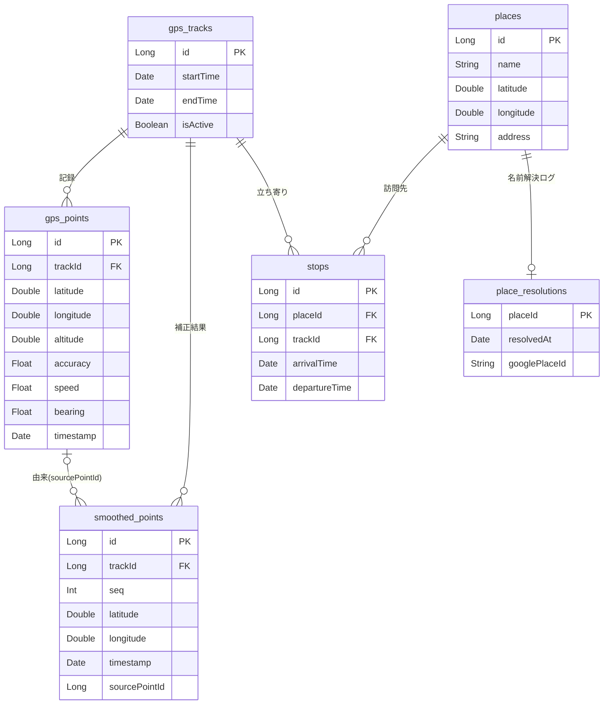

# データモデル

## 概要

Android Room（SQLite）によるローカルデータモデル。GPS 軌跡の記録・補正、立ち寄り・場所の管理を担う。
本書は**概念モデル**（エンティティと関連）を示す。実装は `android/app/src/main/java/com/pathly/data/local/entity/` を参照。

## データベース構成

- **DB**: PathlyDatabase（Room）
- **バージョン**: 4
  - v2: places / stops を追加
  - v3: smoothed_points を追加
  - v4: place_resolutions（Google 解決ログ）を追加
- **マイグレーション**: 破壊的フォールバックは無効。スキーマ変更は `DatabaseMigrations` に正式マイグレーションを追加する。

## ER 図（概念モデル）

> 概念モデルのため、監査用の `createdAt` / `updatedAt` は省略している。

## エンティティ一覧

| エンティティ          | 役割                                           | 主な関連                                        |
| --------------------- | ---------------------------------------------- | ----------------------------------------------- |
| **gps_tracks**        | お出掛け 1 回分の記録セッション                | gps_points / smoothed_points / stops を従える   |
| **gps_points**        | 原 GPS 座標（無改変で保持）                    | gps_tracks に属す                               |
| **smoothed_points**   | 補正（スムージング）後の点列。原データと併存   | gps_tracks に属す／sourcePointId で生点を辿れる |
| **places**            | 場所そのもの（経路から独立して永続）           | stops から参照される                            |
| **stops**             | 立ち寄り（訪問）。places と gps_tracks を結ぶ  | 経路削除で消える（場所は残す）                  |
| **place_resolutions** | 場所名の解決ログ（行の有無＝問い合わせ済みか） | places に 1:0..1                                |

### 関連と削除規則（要点）

- `gps_tracks` を削除すると、配下の `gps_points` / `smoothed_points` / `stops` も削除される（CASCADE）。
- `stops` を削除しても `places` は残す（場所は複数の立ち寄りで再利用されるため）。
- `place_resolutions` は `places` に従属し、場所の削除で一緒に消える。
- `smoothed_points.sourcePointId` は由来の生点への参照（トレース用・任意）。DB 上の外部キー制約は張らない。

## データに関する方針

- **原データ保持**: 生の GPS（`gps_points`）は無改変で残し、補正結果は `smoothed_points` に併存させる。
- **位置情報保護**: 位置情報の削除はユーザーに委ね、自動削除はしない。
- **暗号化**: 将来、機密データはアプリレベルでの暗号化を検討する。
