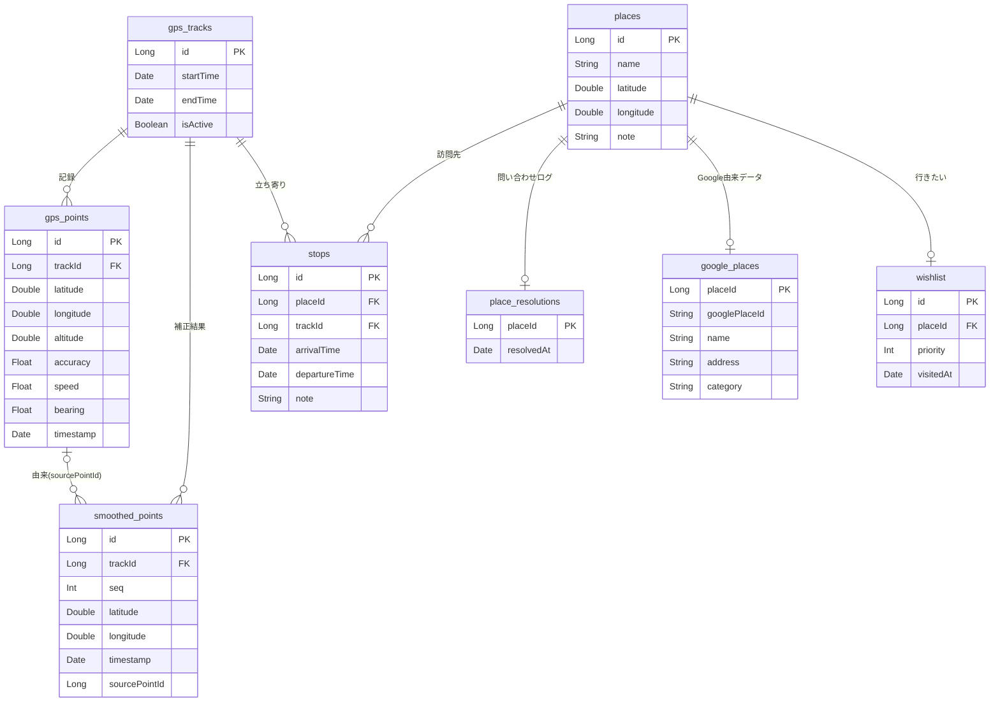

# データモデル

## 概要

Android Room（SQLite）によるローカルデータモデル。GPS 軌跡の記録・補正、立ち寄り・場所の管理を担う。
本書は**概念モデル**（エンティティと関連）を示す。実装は `android/app/src/main/java/com/pathly/data/local/entity/` を参照。

## ER 図（概念モデル）

> 概念モデルのため、監査用の `createdAt` / `updatedAt` は省略している。

## エンティティ一覧

| エンティティ          | 役割                                                 | 主な関連                                               |
| --------------------- | ---------------------------------------------------- | ------------------------------------------------------ |
| **gps_tracks**        | お出掛け 1 回分の記録セッション                      | gps_points / smoothed_points / stops を従える          |
| **gps_points**        | 原 GPS 座標（無改変で保持）                          | gps_tracks に属す                                      |
| **smoothed_points**   | 補正（スムージング）後の点列。原データと併存         | gps_tracks に属す／sourcePointId で生点を辿れる        |
| **places**            | 場所そのもの（ユーザー入力＝自分の名前・メモ・座標） | stops から参照される                                   |
| **stops**             | 立ち寄り（訪問）。places と gps_tracks を結ぶ        | 経路削除で消える（場所は残す）／訪問メモ `note` を持つ |
| **place_resolutions** | Google 問い合わせログ（行の有無＝問い合わせ済みか）  | places に 1:0..1                                       |
| **google_places**     | Google 由来データ（place ID・名前・住所・カテゴリ）  | places に 1:0..1（行＝該当 POI あり）                  |
| **wishlist**          | 行きたい場所（優先度・訪問済み。メモは places.note） | places に 1:0..1                                       |

### 関連と削除規則（要点）

- `gps_tracks` を削除すると、配下の `gps_points` / `smoothed_points` / `stops` も削除される（CASCADE）。
- `stops` を削除しても概念上は `places` を残す（場所は複数の立ち寄りで再利用されるため）。ただし履歴画面の削除ではアプリ側で**孤立回収**を行い、削除後にどの `stops` からも参照されず `wishlist` にも無い place は場所ごと消す。
- `place_resolutions` / `google_places` は `places` に従属し、場所の削除で一緒に消える。
  Google 由来（名前・住所・カテゴリ）は `google_places` に分離し、`places` はユーザー入力（自分の名前・メモ）のみ保持する。
- `smoothed_points.sourcePointId` は由来の生点への参照（トレース用・任意）。DB 上の外部キー制約は張らない。
- `wishlist` は `places` に従属し（1 place 1件・placeId は UNIQUE）、place の削除で一緒に消える。ただし place は通常消さない（再利用のため静的に保つ）。

## データに関する方針

- **原データ保持**: 生の GPS（`gps_points`）は無改変で残し、補正結果は `smoothed_points` に併存させる。
- **位置情報保護**: 位置情報の削除はユーザーに委ね、自動削除はしない。
- **暗号化**: 将来、機密データはアプリレベルでの暗号化を検討する。
