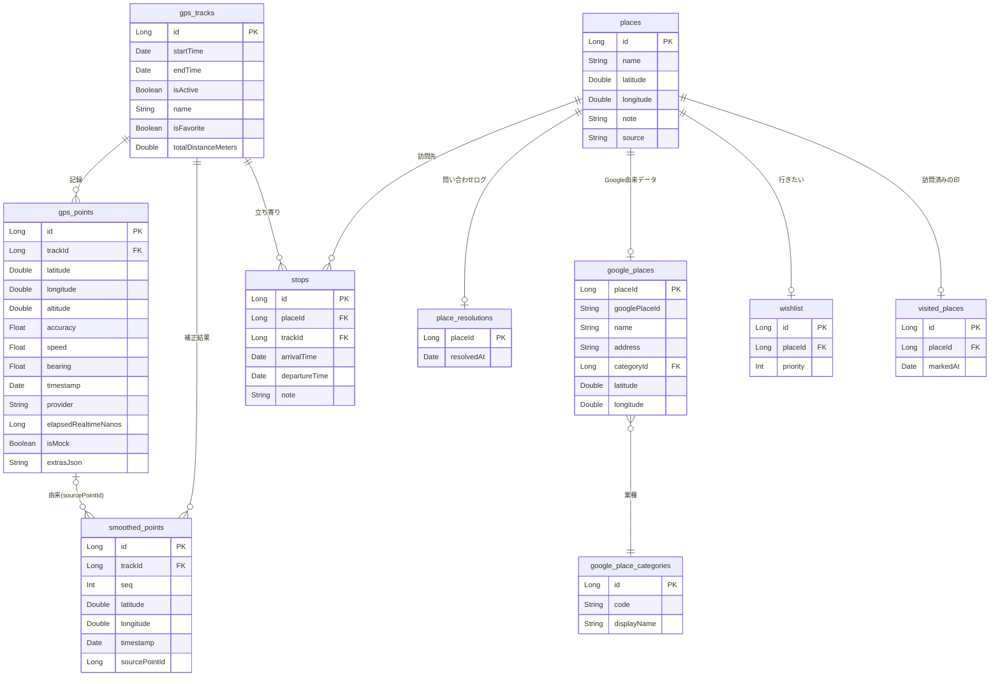

# データモデル

## 概要

Android Room（SQLite）によるローカルデータモデル。GPS 軌跡の記録・補正、立ち寄り・場所の管理を担う。
本書は**概念モデル**（エンティティと関連）を示す。実装は `android/app/src/main/java/com/pathly/data/local/entity/` を参照。

## ER 図（概念モデル）

> 概念モデルのため、監査用の `createdAt` / `updatedAt` は省略している。
> `gps_points` は端末が返す付随情報（各種精度・MSL 高度・provider など）を**取れるだけ全部**持つ。
> 図では代表的なものだけ挙げる。

## エンティティ一覧

| エンティティ                | 役割                                                                                             | 主な関連                                               |
| --------------------------- | ------------------------------------------------------------------------------------------------ | ------------------------------------------------------ |
| **gps_tracks**              | お出掛け 1 回分の記録セッション。名前・お気に入り・確定時に焼き込む総移動距離を持つ              | gps_points / smoothed_points / stops を従える          |
| **gps_points**              | 原 GPS 座標（無改変で保持）                                                                      | gps_tracks に属す                                      |
| **smoothed_points**         | 補正（スムージング）後の点列。原データと併存                                                     | gps_tracks に属す／sourcePointId で生点を辿れる        |
| **places**                  | 場所そのもの（自分の名前・メモ・同定用のアンカー座標）。由来（`source`）で自動回収の対象を分ける | stops から参照される                                   |
| **stops**                   | 立ち寄り（訪問）。places と gps_tracks を結ぶ                                                    | 経路削除で消える（場所は残す）／訪問メモ `note` を持つ |
| **place_resolutions**       | Google 問い合わせログ（行の有無＝問い合わせ済みか）                                              | places に 1:0..1                                       |
| **google_places**           | Google 由来データ（place ID・名前・住所・カテゴリ・施設の座標）                                  | places に 1:0..1（行＝該当 POI あり）                  |
| **google_place_categories** | 業種のマスタ（`code`＝Google の primaryType・表示名）                                            | google_places から参照される（多対 1）                 |
| **wishlist**                | 行きたい場所（優先度のみ。メモは places.note）                                                   | places に 1:0..1                                       |
| **visited_places**          | 手動で「訪問済み」にした印（行の存在＝訪問済み・`markedAt`＝印を付けた日時）                     | places に 1:0..1                                       |

### 関連と削除規則（要点）

- `gps_tracks` を削除すると、配下の `gps_points` / `smoothed_points` / `stops` も削除される（CASCADE）。
- `stops` を削除しても概念上は `places` を残す（場所は複数の立ち寄りで再利用されるため）。ただし履歴画面の削除ではアプリ側で**孤立回収**を行い、削除後にどの `stops` からも参照されず `wishlist` にも無い place は場所ごと消す。
- `place_resolutions` / `google_places` は `places` に従属し、場所の削除で一緒に消える。
  Google 由来（名前・住所・カテゴリ・座標）は `google_places` に分離し、`places` は自分の名前・メモと
  **同定用のアンカー座標**のみ保持する。
- **座標は 2 か所にあり、役目が違う** → [ADR-0023](../adr/0023-place-identity-and-coordinate-anchor.md)。
  `places` の座標は**アンカー**（非 null・作成時に確定し、以後は自動処理で書き換えない）で**同定に使う**。
  `google_places` の座標は Google が持つ施設の代表点（nullable）で**表示に使う**。
  表示は `COALESCE(google_places.latitude, places.latitude)`。
- `google_place_categories` は `google_places` より長生きする**マスタ**で、場所を消しても残る（NO ACTION）。
  業種の同一性は `code`（Google の `primaryType`）の UNIQUE で担保し、判定は必ず `code` で行う
  （`displayName` はロケール依存の表示専用）→ [ADR-0017](../adr/0017-normalize-place-category.md)。
- `smoothed_points.sourcePointId` は由来の生点への参照（トレース用・任意）。DB 上の外部キー制約は張らない。
- `wishlist` / `visited_places` は `places` に従属し（1 place 1件・placeId は UNIQUE）、place の削除で一緒に消える。ただし place は通常消さない（再利用のため静的に保つ）。
- **行きたいと訪問済みは別の軸**で、片方が他方の前提にならない。行きたいを外しても訪問済みの印は残る → [ADR-0020](../adr/0020-visited-independent-from-wishlist.md)。
  訪問済みの判定は「`stops` がある **or** `visited_places` に印がある」。`markedAt` は**印を付けた日時**で、実際に訪れた日時（`stops.arrivalTime`）ではない。

### 索引

- `places(latitude, longitude)` … 同定（同一場所の判定）の近傍検索が全表走査にならないように張る。
  記録中は位置のバッチごとに引かれるため、場所が増えるほど効く。表示座標で絞る近接確認は
  `COALESCE` を挟むためこの索引が効かないが、タップ 1 回に 1 度なので許容している。
- 親子関係（`trackId` / `placeId` など）の索引は Room が外部キーに対して要求するぶんを持つ。

## データに関する方針

- **原データ保持**: 生の GPS（`gps_points`）は無改変で残し、補正結果は `smoothed_points` に併存させる。
  精度の丸めや間引きはしない（あとから補正・再解析するため）。
- **位置情報保護**: 位置情報の削除はユーザーに委ね、自動削除はしない。
- **暗号化**: していない（平文）。端末内で完結し、サーバーへは送らない。
